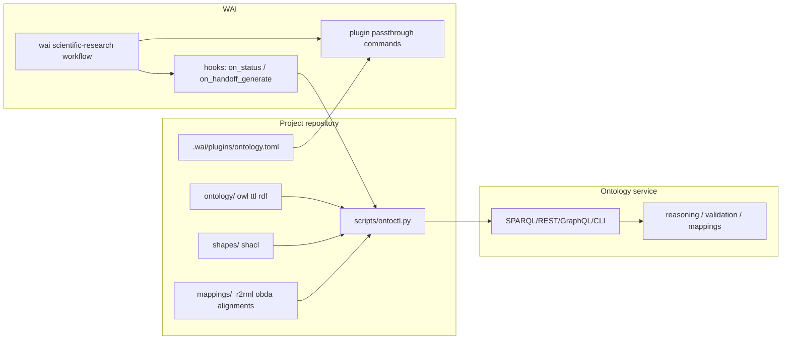
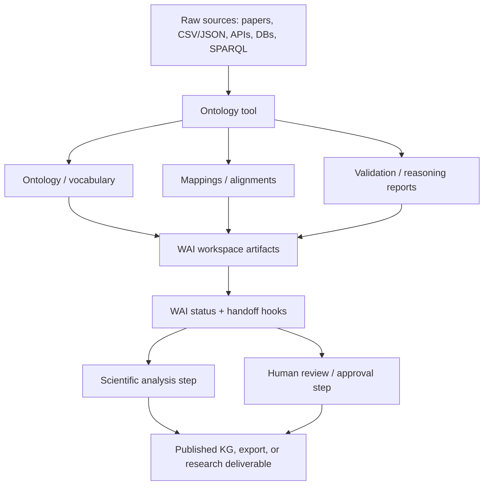

# Ontology Tooling Options for WAI Plugin Integration

## Executive summary

WAI’s plugin model is unusually favorable for ontology tooling because it is **wrapper-first**: WAI detects tools from the workspace or command availability, then exposes them through pass-through commands and hook outputs rather than through a deep in-process SDK. In practice, that means an ontology platform only needs one of three things to fit cleanly into WAI: a stable CLI, a stable HTTP/SPARQL/GraphQL surface, or a library that can be wrapped behind a thin local script. WAI’s built-in OpenSpec integration is also folder-based and status-oriented, which is a good clue for how an ontology plugin should behave in the same ecosystem. citeturn8view0turn7view0turn9view0

Across the candidates I reviewed, the strongest **open-source automation fit** for WAI is **Apache Jena / Fuseki**: it combines standards coverage, SHACL, OWL handling, a persistent store, command-line tools, and an HTTP SPARQL server with minimal operational friction. The strongest **relational-data-to-ontology fit** is **Ontop**, because it turns SQL systems into a virtual knowledge graph without forcing materialization. The strongest **open-source collaborative curation and alignment fit** is **VocBench**, which is unusually good at ontology/thesaurus editing and alignment validation, though its operations model is heavier than a plain triplestore. For **enterprise-scale reasoning and virtualization**, **Stardog** and **GraphDB** stand out; **TopBraid EDG** is the strongest option when governance, crosswalks, and model-driven workflows matter more than a lightweight runtime. **Eclipse RDF4J** is an excellent JVM-native baseline when you want a flexible OSS server/framework but not the extra product surface of GraphDB or Stardog. **Protégé** remains highly valuable for human-in-the-loop authoring, but it is not the best primary runtime for unattended WAI automation. citeturn14view0turn14view1turn14view5turn14view6turn14view7turn15search0turn19search13turn21view1turn24view2

My practical shortlist for WAI is therefore:

- **Best default OSS runtime:** Apache Jena / Fuseki. citeturn14view0turn24view5turn25search9turn14view3
- **Best SQL-to-ontology bridge:** Ontop. citeturn14view7turn30search3turn29search0
- **Best collaborative ontology curation:** VocBench. citeturn15search0turn37search4turn37search3turn15search5
- **Best enterprise runtime with virtualization:** Stardog or GraphDB, depending on whether you value broader connector/virtualization emphasis or a more RDF4J-centered stack. citeturn21view2turn21view5turn21view1turn14view2turn19search13turn42search16
- **Best governance-heavy option:** TopBraid EDG. citeturn38search7turn17search12turn39search19

## WAI fit and evaluation lens

The central architectural fact is that WAI scans `.wai/plugins/*.toml`, supports directory/file/command detectors, exposes pass-through commands as `wai <plugin> <command>`, and lets plugins inject context through hooks such as `on_status` and `on_handoff_generate`. That makes WAI much closer to a **tool orchestrator** than a monolithic semantic platform. For ontology work, the cleanest design is therefore usually: keep ontology artifacts in the repo, run an external ontology service or CLI, then inject summaries, validations, mappings, and provenance back into WAI through hooks. citeturn8view0

This architecture favors tools that are both **artifact-centric** and **programmable**. The higher-scoring candidates therefore expose at least one of the following: SPARQL endpoints, REST/GraphQL APIs, a CLI, or stable Java/Python/JS libraries. Tools that are mostly GUI-first can still help, but they fit WAI better as a human checkpoint than as the main automated plugin. That distinction is the main reason Protégé is recommended as an auxiliary authoring layer, while Jena/Fuseki, Ontop, GraphDB, Stardog, TopBraid EDG, RDF4J, and VocBench are stronger primary plugin candidates. citeturn14view0turn26search1turn19search13turn22search0turn38search7turn37search4turn14view6

The design implication for WAI is shown below. The important point is that WAI does not need to “know ontology internals”; it only needs a thin adapter that can surface ontology operations as stable commands and hook outputs. citeturn8view0



## Comparative table of candidate tools

The table below emphasizes **officially documented** capabilities. Where a feature was not explicit in the inspected official documentation, I mark it as **unspecified** instead of assuming support.

| Tool | License | Supported ontology formats | Plugin / extension capability | APIs / SDKs | Ease of integration with WAI | Extra data sources | Ontology mapping / alignments | Reasoning / inference | Scalability / performance | Community / activity | Maturity / stability | Example use-cases | Primary sources |
|---|---|---|---|---|---|---|---|---|---|---|---|---|---|
| **Apache Jena / Fuseki** | Apache-2.0 | RDF/XML, Turtle, TriG, N-Triples, N-Quads, JSON-LD, TriX, RDF/JSON, RDF Binary; OWL handling; SHACL; ShEx | Strong modular extension story; custom syntaxes can be integrated into parser/writer registries | Java APIs, RDF Connection, Fuseki HTTP server, command-line tools | **High** — excellent for a thin WAI wrapper around CLI or HTTP; Python/JS usually via plain HTTP rather than official SDKs | Files and local datasets; remote SPARQL services documented; CSV/API/DB linking not first-class in the inspected core docs | No dedicated alignment workbench documented in core; custom SPARQL/rules workflow is feasible | Jena rules engine, inference, OWL handling, SHACL validation | TDB2 persistent store; streaming I/O; good OSS runtime for medium-to-large automation | Active Apache release train, with Jena 6.0.0 current in the inspected release page | Very mature, low-risk OSS foundation | Local ontology validation, SHACL gating, RDF normalization, offline scientific KG builds | Official docs / release citeturn24view0turn24view5turn14view0turn25search1turn14view3turn25search5turn25search9 |
| **Eclipse RDF4J** | BSD-3-Clause | RDF formats through Rio; explicit JSON-LD, Turtle, N-Triples, RDF/XML examples; SHACL; RDF-star with Turtle-star and TriG-star; RDFS/OWL semantics via Sail stack configuration | Moderate-to-strong framework extensibility through Repositories and Sail stack composition | Java Repository API, RDF4J Server, Workbench, REST API, Console CLI | **High** for Java/HTTP/CLI; **Medium** for Python/JS because official docs emphasize Java and HTTP | Native support for SPARQL endpoints and RDF4J servers; vendor-neutral access to RDF databases | No native ontology alignment workflow documented | Storage, querying, reasoning, SHACL; semantics depend on configured Sail stack | Scalable storage and server options; recent LMDB performance improvements documented in releases | Active project with recent releases and 2026 repo activity | Mature, stable JVM stack | JVM-heavy semantic services, lightweight server integration, SHACL QA in pipelines | Official docs / releases / repo citeturn14view1turn14view4turn26search1turn26search2turn26search3turn26search4turn26search5turn24view4turn23search9 |
| **GraphDB** | GraphDB Free is commercial & free to use; GraphDB EE is commercial and not open source | Support for RDF serializations; JSON-LD 1.1 noted in release docs; OWL; SHACL; SPARQL 1.1 incl. federation | Strong — GraphDB Plugin API and extensible Workbench/plugin surfaces | GraphDB REST API, RDF4J API, GraphDB Client API jar, official JS client, official Python path via rdflib, Maven artifacts | **High** technically; **Medium** operationally because licensing and product administration are heavier than Jena/RDF4J | OntoRefine for CSV/TSV/XLS/XLSX/JSON/XML/Google Sheets; relational virtualization via R2RML or OBDA; remote URL/file imports | Strong data-to-RDF mapping; dedicated ontology-to-ontology alignment tooling is **unspecified** in inspected official docs | Forward-chaining total materialization, custom rulesets, provenance plugin, SHACL repositories | Designed for massive volumes and fast query evaluation; cluster support; Free edition limits concurrency | Active current release train; public community touchpoints include Stack Overflow plus vendor support | Mature enterprise semantic platform | Large research knowledge graphs, rule-heavy inference, SHACL repositories, programmatic data triplification | Official docs / release notes citeturn18search12turn18search18turn14view2turn19search0turn19search13turn42search0turn42search9turn42search11turn42search16turn18search22 |
| **Stardog** | Proprietary; Stardog Free is no-cost but not open source, with feature limits vs Enterprise | N-Triples, RDF/XML, Turtle, TriG, N-Quads, JSON-LD; SHACL; OWL & rule reasoning; GraphQL query surface | Strong in practice through mappings, rules, APIs, Studio, and connectors; a first-class public plugin SDK is **not prominently documented** in the inspected sources | HTTP API, Java SNARL API, JS client, CLI, Studio; Python support is documented through tutorials/ecosystem docs | **High** technically through HTTP/CLI/JS/Java; **Medium** operationally due licensing and platform weight | Virtual Graphs cover relational DBs, CSV, JSON, NoSQL, SPARQL services, cloud services, files/unstructured data, CRM classes of sources | Very strong source-to-graph mapping; dedicated ontology alignment workbench is **unspecified** | OWL and rule reasoning; SHACL constraints and validation workflow | Scalable disk database; HA cluster, read replicas, distributed cache, Kubernetes docs | Active vendor docs, releases, and community forum | Mature enterprise platform | Hybrid knowledge graph over live sources, virtualized scientific data federation, constraint-aware graph apps | Official docs / pricing / cluster docs citeturn21view0turn21view1turn21view2turn21view3turn21view4turn21view5turn22search0turn22search1turn22search2turn21view7turn36search1turn36search2turn36search5turn36search8 |
| **TopBraid EDG** | Commercial / licensed | Ontologies and SHACL-centric modeling; export to JSON-LD, RDF/XML, N-Triples, Turtle, Turtle+, TriG, JSON, CSV, TSV, XML; GraphQL schemas can be generated from SHACL, and OWL/RDFS can be converted | **Very strong** — extension points for web services, scheduled jobs, functions, custom collection types, UI actions, ADS/JavaScript | SPARQL endpoint, GraphQL endpoint, Swagger-documented web services, ADS-generated JavaScript APIs | **Medium-High** — excellent API surface, but heavier deployment and licensing than OSS frameworks | Remote SPARQL data sources as virtual asset collections; Neo4j integration; external APIs and corpora connectors | Strong crosswalks and fuzzy-match mapping; many-to-many mappings; alternative algorithms possible via customization | SHACL validation, SHACL rules engine, dynamic inferencing, OWL-to-SHACL conversion | Internal Jena TDB optimized for local speed; remote triple stores recommended when scale goes to billions | Active vendor documentation; public community/activity metrics are less open than OSS stacks | Mature enterprise governance system | Crosswalk-driven ontology/reference-data alignment, governed ontology workflows, API-centered semantic governance | Official docs / guides citeturn14view5turn17search2turn16search4turn16search5turn16search7turn17search12turn38search7turn38search0turn39search19turn39search12turn39search14 |
| **VocBench** | Open source on the official site; **exact current license is unspecified on the inspected official site** | OWL ontologies, SKOS/SKOS-XL thesauri, OntoLex-Lemon lexicons, generic RDF datasets; more than a dozen RDF serializations are supported for loading; RDF/XML export is explicit; Turtle code-view editing is explicit | Strong extension model through Semantic Turkey Web API, custom services, loader/lifter plugins, dataset catalog connector, collaboration adapters | Semantic Turkey Web API for all functions; REST/OpenAPI alignment-service interface; custom HTTP services; mainstream Python/JS SDKs are **unspecified** | **Medium** — conceptually very good for WAI, but deployment and API ergonomics are heavier than Jena/Fuseki or Ontop | Files, triple stores, custom sources; metadata registry for remote datasets; Graph Store HTTP deployment | **Strong** — alignment validation from file or remote alignment system; accepted alignments can be projected onto OWL/SKOS mapping properties | OWL consistency check / integrity validation are documented | Backend-dependent; good for collaborative curation, but scale depends heavily on the Semantic Turkey / triplestore deployment underneath | Official site emphasizes ongoing institutional backing and user feedback; formal public activity metrics are limited in the inspected docs | Mature collaborative semantic editor | Collaborative ontology curation, thesaurus/lexicon editing, semi-curated alignment review, ontology publication pipelines | Official docs / official site / official paper support citeturn15search0turn37search4turn41search2turn41search7turn37search1turn37search3turn14view8turn14view9turn15search5turn37search13turn34search15 |
| **Ontop** | Apache-2.0 | RDF 1.1, RDFS, OWL 2 QL, R2RML, Ontop mappings, SPARQL 1.1; SHACL is **unspecified** in the inspected official docs | Strong for virtualization and DB adapters; Protégé plugin; explicit docs on extending support to new DB systems | CLI, SPARQL endpoint, Protégé plugin, Java/Maven API examples; official JS/Python SDKs are **unspecified** | **High** when WAI needs live relational data under an ontology; **Medium** outside the relational-virtualization use-case | Broad JDBC-backed sources including DB2, MySQL/MariaDB, Oracle, PostgreSQL, SQL Server, H2, Denodo, Dremio, Spark/Databricks, Teiid, Snowflake, Trino, Presto, Athena, Redshift, DuckDB, BigQuery, and more | Very strong **OBDA/data-source** mapping; ontology-to-ontology alignment is **not** a core goal | OWL 2 QL / RDFS-aware query rewriting and datatype checks | Efficient SQL rewriting; avoids materialization; good fit for “virtual KG” patterns | Active releases and active backing from research and commercial organizations | Mature research-to-production virtualization stack | Querying live scientific databases as a virtual ontology layer, exposing SPARQL over SQL systems | Official guide / repo / releases citeturn14view7turn24view2turn29search3turn29search0turn29search8turn30search0turn30search2turn30search3turn29search9turn23search18 |
| **Protégé** | Open source; **exact license is unspecified on the inspected homepage** | Full OWL 2 support; WebProtégé documents RDF/XML, Turtle, OWL/XML, OBO, and others for upload/download | Very strong for desktop extensibility through plug-in architecture; spreadsheet-to-OWL support is documented through the Cellfie plugin | Java-centric ecosystem; plugin architecture; WebProtégé backend/microservice APIs exist, but stable public automation interfaces are limited/unspecified in the inspected official docs | **Low-Medium** for unattended WAI automation; **High** for human-in-the-loop modeling and review | Spreadsheet-based ontology population via Cellfie; external live-source linkage is not a core documented strength | Plugin-ecosystem-based rather than core documented workflow; built-in alignment workflow is **unspecified** | Reasoner/plugin ecosystem exists in practice, but reasoning specifics are not detailed on the inspected homepage | Strong for authoring; weaker as a primary automation/runtime layer | Official site explicitly says there is an active community; WebProtégé is in active next-gen microservice transition | Extremely mature and widely adopted in ontology engineering | Expert ontology authoring, review, curation checkpoints, spreadsheet-driven ontology population | Official site / WebProtégé repo / plugin docs citeturn14view6turn24view3turn31search5turn31search0turn23search7 |

## Recommended integration patterns for WAI

The most robust WAI design is not to bind WAI directly to a vendor-specific API. Instead, create a **repository-local adapter** that exposes a small, stable command surface such as `status`, `query`, `validate`, `map`, and `report`. WAI is built to consume exactly that style of interface through its custom plugin TOML files and hook system. This keeps the WAI layer stable even if you swap Jena for GraphDB, or Ontop for Stardog, later. citeturn8view0

The first pattern is the **lightweight runtime pattern**, best with Jena/Fuseki or RDF4J. Store ontologies, shapes, mappings, and queries in the repository; run Fuseki or RDF4J Server locally or in Docker; wrap a handful of commands in a thin script; and inject status summaries and validation results into WAI. This is the lowest-friction path to a real ontology plugin because both stacks already expose standard HTTP/SPARQL and CLI-friendly operations. citeturn24view5turn25search9turn26search2turn26search4turn8view0

The second pattern is the **virtual-knowledge-graph pattern**, best with Ontop, and sometimes Stardog or GraphDB. Here the ontology layer does not materialize all data into RDF. Instead, WAI’s plugin triggers endpoint startup, mapping checks, query execution, and validation/report generation against a live relational or hybrid data estate. This is the strongest option if your scientific pipeline needs reproducibility against changing upstream databases rather than against static RDF snapshots. Ontop is the cleanest pure-play choice; Stardog and GraphDB become attractive when you also want enterprise reasoning, connectors, or integrated graph runtime features. citeturn14view7turn30search3turn21view2turn42search16

The third pattern is the **collaborative curation pattern**, best with VocBench or TopBraid EDG, and secondarily with Protégé as a manual review station. In that model, WAI does not try to replicate ontology editing. Instead, WAI orchestrates checkpoints: propose a curation task, fetch mappings or crosswalk suggestions, run alignment review or validation, and then archive a handoff summary and export for downstream scientific use. This is ideal if your ontology activity is social, policy-driven, multilingual, or alignment-heavy. citeturn37search4turn37search3turn38search0turn38search7turn14view6

A generic WAI custom plugin descriptor can look like this. It follows the detection and hook model documented by WAI, but keeps the ontology tool itself behind a neutral `ontoctl.py` wrapper. citeturn8view0

```toml
name = "ontology"
description = "Ontology service integration for WAI"

[detector]
type = "command"
path = "python scripts/ontoctl.py --ping"

[[commands]]
name = "status"
description = "Show ontology repository status"
passthrough = "python scripts/ontoctl.py status"
read_only = true

[[commands]]
name = "query"
description = "Run a canned SPARQL query"
passthrough = "python scripts/ontoctl.py query"
read_only = true

[[commands]]
name = "validate"
description = "Run SHACL or consistency checks"
passthrough = "python scripts/ontoctl.py validate"
read_only = true

[[commands]]
name = "report"
description = "Write a handoff-friendly ontology report"
passthrough = "python scripts/ontoctl.py report"
read_only = true

[hooks.on_status]
command = "python scripts/ontoctl.py status --summary"
inject_as = "ontology_status"

[hooks.on_handoff_generate]
command = "python scripts/ontoctl.py report --summary"
inject_as = "ontology_context"
```

A generic Python wrapper can remain endpoint-agnostic by reading the query and validation endpoints from environment variables. That makes the same WAI plugin usable against Fuseki, RDF4J Server, GraphDB, Stardog, Ontop, or a custom service facade on TopBraid EDG or VocBench. The underlying reason this works is that all of those candidates document either an HTTP/SPARQL interface, a web API, or both. citeturn25search9turn26search3turn19search13turn22search0turn38search7turn37search4

```python
import argparse
import json
import os
import sys
import requests

QUERY_URL = os.environ.get("ONTO_QUERY_URL")
HEALTH_URL = os.environ.get("ONTO_HEALTH_URL", QUERY_URL)
VALIDATE_URL = os.environ.get("ONTO_VALIDATE_URL")

def ping() -> int:
    try:
        r = requests.get(HEALTH_URL, timeout=10)
        r.raise_for_status()
        print("ok")
        return 0
    except Exception as exc:
        print(f"unavailable: {exc}", file=sys.stderr)
        return 1

def run_query(sparql: str) -> int:
    r = requests.post(
        QUERY_URL,
        data={"query": sparql},
        headers={"Accept": "application/sparql-results+json"},
        timeout=30,
    )
    r.raise_for_status()
    data = r.json()
    print(json.dumps(data, indent=2))
    return 0

def run_validate() -> int:
    if not VALIDATE_URL:
        print("validation endpoint unspecified", file=sys.stderr)
        return 2
    r = requests.post(VALIDATE_URL, timeout=60)
    r.raise_for_status()
    print(r.text)
    return 0

if __name__ == "__main__":
    parser = argparse.ArgumentParser()
    parser.add_argument("--ping", action="store_true")
    parser.add_argument("command", nargs="?")
    args = parser.parse_args()

    if args.ping:
        raise SystemExit(ping())
    if args.command == "status":
        print("ontology service reachable" if ping() == 0 else "ontology service unavailable")
        raise SystemExit(0)
    if args.command == "query":
        q = "SELECT * WHERE { ?s ?p ?o } LIMIT 20"
        raise SystemExit(run_query(q))
    if args.command == "validate":
        raise SystemExit(run_validate())
    if args.command == "report":
        print("Generate summary from status, validation, and canned queries here.")
        raise SystemExit(0)

    parser.print_help()
    raise SystemExit(1)
```

For a scientific-research workflow, the most useful data flow is to treat ontology assets as first-class research artifacts: source ontologies, mappings, SHACL shapes, alignment files, query packs, and generated provenance/validation reports. The flow below is what I would recommend for WAI regardless of the chosen tool. citeturn8view0turn14view3turn19search0turn21view4turn37search3



## Limitations and decision trade-offs

The largest structural limitation is that WAI plugins are **command-oriented**, not rich embedded extensions. That is a strength for integration speed, but it means GUI-heavy tools need an adapter layer. This is not a problem for Jena/Fuseki, RDF4J, Ontop, GraphDB, Stardog, TopBraid EDG, or VocBench because they all document programmable surfaces; it is more limiting for Protégé, which remains authoring-first. citeturn8view0turn25search9turn26search3turn29search0turn19search13turn22search0turn38search7turn37search4turn14view6

There is also a major distinction between **ontology-alignment tooling** and **data-to-RDF mapping tooling**. Ontop, Stardog, and GraphDB are very strong when the challenge is mapping relational or heterogeneous source systems into ontology terms. TopBraid EDG and VocBench are stronger when the challenge is aligning semantic assets to each other through crosswalks or alignment-review workflows. Jena and RDF4J are excellent programmable substrates, but they do not expose a first-class alignment workbench in the inspected official core docs. citeturn30search3turn21view3turn18search22turn38search0turn37search3turn14view0turn26search1

Reasoning support also varies in operational consequences. GraphDB’s documented forward-chaining materialization is powerful and query-friendly, but it increases load-time work. Ontop’s approach is very different: it rewrites onto live SQL sources and focuses on OWL 2 QL / RDFS-style virtual KG semantics rather than full graph materialization. Stardog sits in between, pairing enterprise-scale graph runtime features with reasoning and SHACL, while TopBraid EDG emphasizes SHACL-driven inferencing and governance workflows. Those are not interchangeable choices; they suit different scientific pipeline philosophies. citeturn14view2turn14view7turn21view1turn21view4turn39search19

Licensing and operating model are another decisive trade-off. Jena, RDF4J, and Ontop are easier to adopt in a repo-centered WAI workflow with fewer procurement dependencies. VocBench is open-source-friendly but operationally heavier. GraphDB, Stardog, and TopBraid EDG are powerful, but they introduce commercial licensing and typically broader platform administration. If the WAI deployment target is a lightweight research repo rather than a managed semantic platform team, that difference will matter immediately. citeturn24view0turn23search9turn29search3turn32search3turn18search12turn21view7turn17search2

## Implementation roadmap

The effort estimates below are my assessment, based on WAI’s wrapper-style plugin model and the documented API surfaces of the candidates. citeturn8view0turn25search9turn26search3turn29search0turn38search7turn37search4

| Phase | Estimated effort | What to build | Recommended tool choices |
|---|---|---|---|
| **Pilot integration** | **Low** | Repository layout for `ontology/`, `shapes/`, `mappings/`; one `ontoctl` wrapper; one `.wai/plugins/ontology.toml`; one `status` hook; one `validate` command | Apache Jena / Fuseki, RDF4J, or Ontop if SQL virtualization is the main requirement. citeturn24view5turn26search4turn29search0 |
| **Operational plugin** | **Medium** | Add canned SPARQL queries, validation reports in handoffs, Dockerized local service, provenance snapshot export, CI checks, and one mapping/alignment review step | Jena/Fuseki + Ontop, or GraphDB/Stardog if reasoning and live-source integration become central. citeturn14view3turn14view7turn42search16turn21view2turn21view4 |
| **Collaborative / governed rollout** | **High** | Multiuser curation workflow, approval gates, crosswalk/alignment review, access control, publication/export pipeline, cluster or managed deployment | VocBench or TopBraid EDG for curation/governance; Stardog or GraphDB for enterprise runtime scale. citeturn37search3turn37search4turn38search0turn38search7turn36search2turn42search11 |

If I were implementing this for WAI from scratch, I would phase it this way. Start with **Jena/Fuseki** if the goal is fastest credible ontology plugin in an OSS repo. Start with **Ontop** if the scientific pipeline mostly needs a virtual ontology layer over existing SQL systems. Start with **VocBench** if the highest-value step is collaborative ontology/alignment curation rather than raw query serving. Move to **GraphDB**, **Stardog**, or **TopBraid EDG** only when scale, governance, or enterprise connectors clearly justify the additional platform weight. citeturn24view5turn14view7turn15search0turn19search13turn21view2turn38search7
